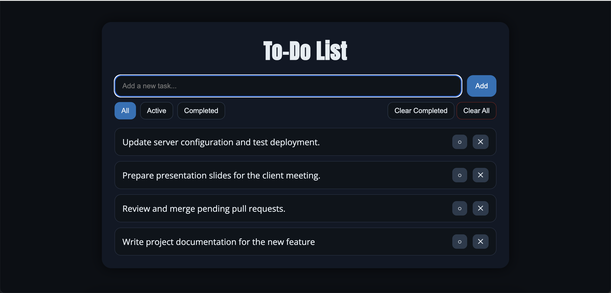

# Simple To-Do List App

A minimal yet modern **to-do list web application** built with **Flask, SQLAlchemy, and Vanilla JavaScript**.

Runs locally with **SQLite** by default and can easily be migrated to **PostgreSQL on AWS RDS** for cloud deployment (Elastic Beanstalk / ECS / EKS).

---

## ✨ Features
- Add, toggle, and delete tasks
- Bulk actions: *Clear All* / *Clear Completed*
- Task filtering: *All / Active / Completed*
- Responsive dark theme UI
- Toast notifications for user feedback
- `/health` endpoint for monitoring and load balancer probes

---

## 🚀 Getting Started

### Requirements
- Python **3.9+**
- `pip`
- (Optional) `python-dotenv` for local `.env` support

---

### Local setup (SQLite fallback)
If no database environment variables are set, the app automatically uses a local SQLite file (`todo.db`).

```bash
# clone repository
git clone https://github.com/irina-hychka/simple-todo-list-app.git
cd simple-todo-list-app

# create virtual environment
python3 -m venv .venv && source .venv/bin/activate

# install dependencies
pip install -r requirements.txt
```

App will be available at http://localhost:5000

### Local setup (PostgreSQL)

Create a .env file in the project root (ignored by Git):

```bash
DB_HOST=your-rds-endpoint.amazonaws.com
DB_PORT=5432
DB_NAME=todo_db
DB_USER=todo_admin
DB_PASSWORD=your_password
PORT=5001  # optional, override local port if 5000 is busy
```

Run with:

```bash
python app.py
```

### Screenshot
